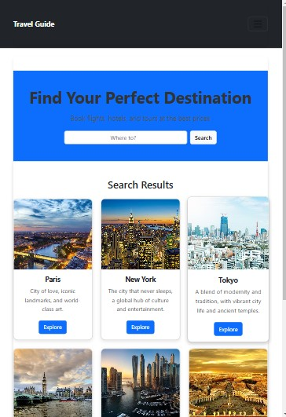
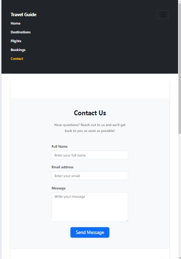
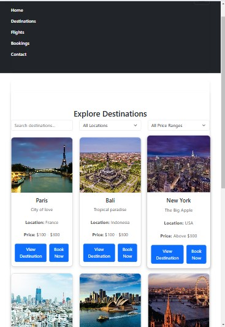
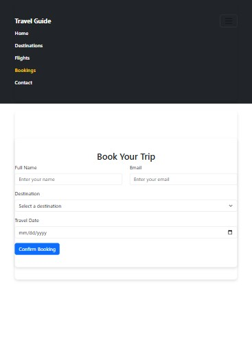

# 🌍 Travel Guide Web App

A **React + TypeScript** web app for exploring travel destinations, booking trips, and getting essential travel info.

## ✨ Features

- 🏖️ Discover **top destinations**
- 🔍 Search & filter locations
- 📅 Book and manage trips
- 🌦️ Integrated **weather info**

- ⭐ User reviews & ratings
- 🌙 Dark mode toggle
- ❤️ Wishlist feature

## 🚀 Tech Stack

- **Frontend:** React (TypeScript), Bootstrap
- **State Management:** React Hooks
- **API Integration:** Weather API, Maps API
- **Styling:** CSS, Bootstrap

## 📸 Screenshots

(Include images or GIFs showcasing your app)

## 📸 Screenshots

### 🏠 Homepage



### 📞 Contact Page



### 🌍 Destination Page



### 🏨 Booking Page



## 📦 Installation

1. Clone the repo:
   ```bash
   git clone https://github.com/your-username/travel-guide.git
   cd travel-guide
   ```
